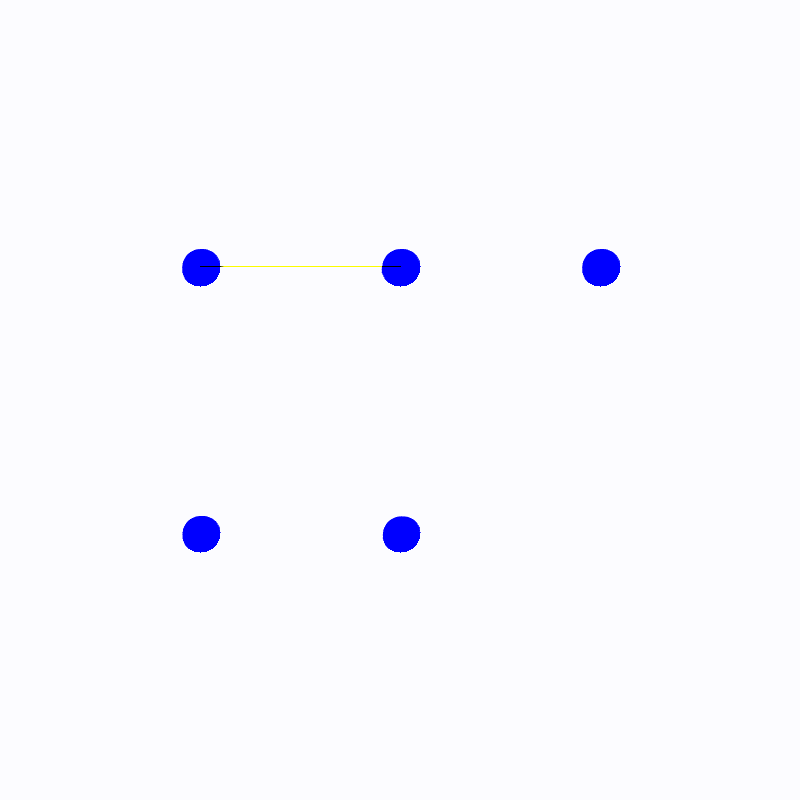
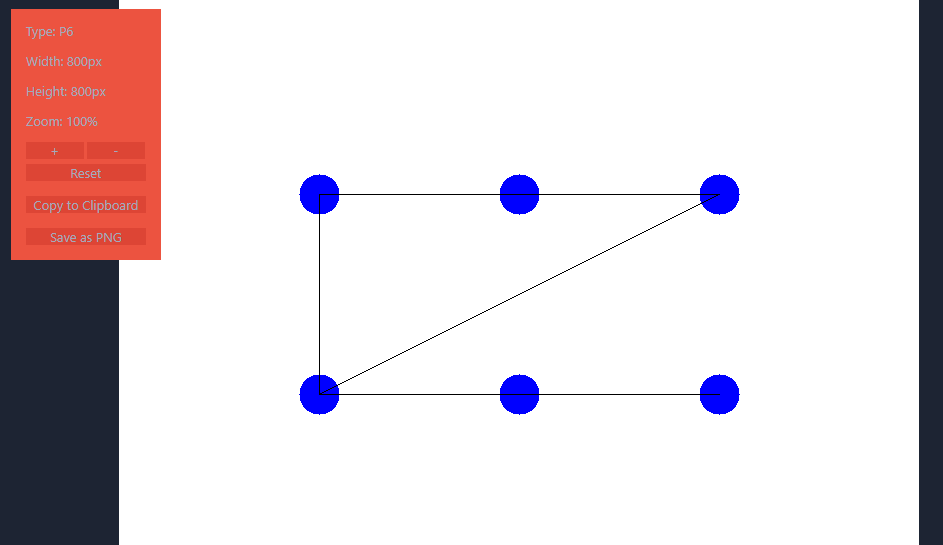

# 💻 Teoria dos Grafos e Computabilidade - Trabalho prático

## 📄 Descrição Geral do Projeto

Este projeto tem como objetivo desenvolver uma biblioteca completa para a manipulação de grafos, abrangendo diferentes representações e funcionalidades avançadas. As principais características incluem:

- Representações de Grafos: Implementação de grafos utilizando matriz de adjacência, matriz de incidência e lista de adjacência, permitindo flexibilidade conforme a necessidade.

- Manipulação e Análise: Funções básicas e avançadas para criação, modificação e análise de grafos, incluindo checagens de adjacência, conectividade, detecção de pontes e articulações, e identificação de componentes fortemente conexos usando o algoritmo de Kosaraju.

- Detecção de Pontes: Implementação de dois métodos para identificação de pontes em grafos: um método ingênuo que testa a conectividade após a remoção de cada aresta e um método otimizado baseado no algoritmo de Tarjan.

- Caminho Euleriano: Utilização do Algoritmo de Fleury para encontrar caminhos eulerianos em grafos, comparando a eficiência das duas estratégias de detecção de pontes implementadas.

- Exportação para Gephi: Funcionalidade para ler e salvar grafos em formatos compatíveis com o software de visualização Gephi, permitindo a geração de ilustrações e análises visuais avançadas.

A estrutura de diretórios foi organizada para facilitar a manutenção, escalabilidade e colaboração entre os membros da equipe, separando claramente os componentes do projeto e promovendo boas práticas de desenvolvimento.

`24/11/2024`

## 👨‍🏫 Professor

- Leonardo Vilela Cardoso

## 🧑‍🎓 Integrantes

- Gustavo Pereira de Oliveira
- Luís Felipe Teixeira Dias Brescia
- Luiz Felipe Campos de Morais
- Marcus Vinícius Carvalho de Oliveira
- Victor Reis Carlota

## 📂 Estrutura de diretórios

- `models/`: Armazena os arquivos relacionados aos modelos e representações de grafos. Inclui as implementações das estruturas de dados para matriz de adjacência, matriz de incidência e lista de adjacência, bem como classes e métodos associados.
- `tests/`: Contém os scripts e arquivos de teste utilizados para validar as funcionalidades do projeto. Inclui casos de teste, testes unitários e de integração para garantir a corretude e a robustez do código.
- `utils/`: Reúne funções utilitárias e auxiliares que suportam o projeto. Inclui funções para manipulação de arquivos, conversão de formatos, gerenciamento de logs e outras ferramentas que facilitam o desenvolvimento e a manutenção do código.
- `dados/`: Onde serão armazenados os arquivos de saida.

## ⌨️ Uso

- Navegue até o diretório "code"
- Dentro do direório

```bash
python main.py
```

- Para poder importar a nossa biblioteca

```bash
pip install -e GraphsKit/
```

## 📽️ Demonstração


